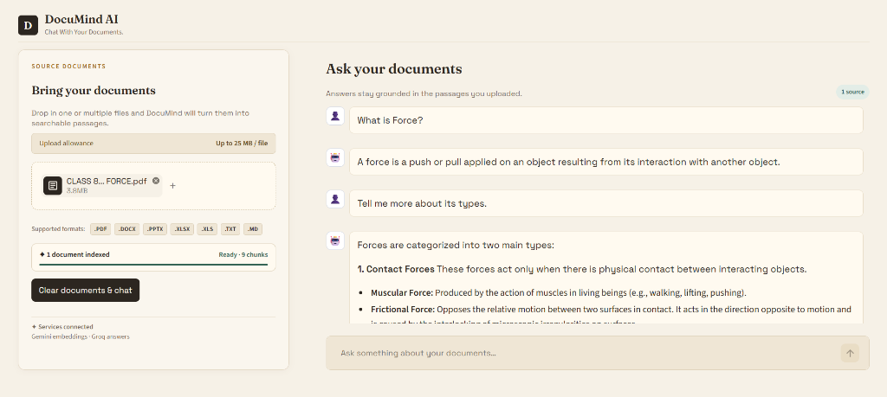

# 📜 DocuMind AI

<p align="center">
  <strong>An elegant, lightning-fast Retrieval-Augmented Generation (RAG) assistant for chatting with your documents.</strong>
</p>

<p align="center">
  
  
  
  
  
</p>

<p align="center">
  
</p>

---

## 🌐 Live Demo

> 🚀 **Live Application:** [Click here to launch DocuMind AI](https://your-deployed-app-link.streamlit.app)
> 

---

## 🌟 Overview

**DocuMind AI** turns your unstructured files into an interactive, deeply grounded knowledge base. Built with **Streamlit**, **Google Gemini embeddings**, and **Groq LPUs**, DocuMind AI allows you to upload documents across multiple formats, indexes them with semantic embeddings in memory, and gives you direct, accurate answers with zero hallucination.

Designed with a warm, editorial aesthetic inspired by print typography and quiet reading desks, DocuMind AI offers a distraction-free experience for research, study, and document analysis.

---

## ✨ Key Features

- **📑 Multi-Format Document Ingestion**: Upload one or multiple documents simultaneously (`.pdf`, `.docx`, `.pptx`, `.xlsx`, `.xls`, `.txt`, `.md`).
- **🧠 Semantic Gemini Embeddings**: Uses Google's `gemini-embedding-001` (1536-dimensional vectors) with specialized task types for documents and queries.
- **⚡ Blazing Fast Answers with Groq**: Powered by Groq-accelerated LLMs (default: `qwen/qwen3.8-27b`) delivering answers in milliseconds.
- **🎯 Strictly Grounded Responses**: Prompts are tuned to answer strictly from document excerpts with zero hallucination and clean output.
- **🔍 In-Memory Vector Search**: Fast, normalized cosine similarity retrieval powered directly by NumPy—no bulky external vector database required.
- **📚 Multi-Document Cross-Referencing**: Upload multiple files at once; passages are automatically prefixed with origin document tags (e.g. `[report.pdf] ...`).
- **💬 Conversational Memory**: Preserves multi-turn dialogue context so you can ask natural follow-up questions.
- **🎨 Bespoke Editorial UI**: Tailored warm paper palette (`#f6f1e7`), typography from Google Fonts (`Fraunces` serif & `Space Grotesk`), clean status bars, and responsive layout.

---

## 📂 Project Structure

```text
RAG Project/
│
├── assets/
│   └── documind-preview.png  # Application screenshot
├── app.py                     # Streamlit frontend, session state & chat loop
├── extractor.py               # Multi-format document text extraction engine
├── rag.py                     # Chunking, Gemini vector embeddings, retrieval & Groq answering
├── requirements.txt           # Project dependencies
├── .env.example               # Template for environment variables and API keys
├── .env                       # Local configuration file (create from .env.example)
└── .streamlit/
    └── config.toml            # Custom Streamlit server limits and color theme
```

---

## 📄 Supported Formats

| Format | File Extension | Underlying Parser | Extracted Content |
| :--- | :--- | :--- | :--- |
| **PDF Documents** | `.pdf` | `pypdf` | Full text across all pages |
| **Word Documents** | `.docx` | `python-docx` | Paragraph text, headings, and table cells |
| **PowerPoint Slides** | `.pptx` | `python-pptx` | Slides and text shapes with slide separators |
| **Excel Spreadsheets** | `.xlsx` | `openpyxl` | Worksheets, rows, and structured cell values |
| **Legacy Excel** | `.xls` | `xlrd` | Worksheets, rows, and cell records |
| **Plain Text & Markdown** | `.txt`, `.md` | Built-in UTF-8 decoder | Clean raw text |

---

## 🚀 Quick Start Guide

### 1. Prerequisites

- **Python 3.10+** installed on your system.
- **Google Gemini API Key** (from [Google AI Studio](https://aistudio.google.com/)).
- **Groq Cloud API Key** (from [Groq Console](https://console.groq.com/keys)).

### 2. Clone or Navigate to the Repository

```bash
cd "path/to/RAG Project"
```

### 3. Create and Activate a Virtual Environment

**Windows (PowerShell):**
```powershell
python -m venv venv
.\venv\Scripts\Activate.ps1
```

**macOS / Linux:**
```bash
python3 -m venv venv
source venv/bin/activate
```

### 4. Install Dependencies

```bash
pip install -r requirements.txt
```

### 5. Configure API Keys

Copy the example environment file:

```bash
# Windows
copy .env.example .env

# macOS / Linux
cp .env.example .env
```

Open `.env` in your editor and add your keys:

```ini
GOOGLE_API_KEY=your_google_gemini_api_key_here
GROQ_API_KEY=your_groq_api_key_here

# Optional overrides
EMBEDDING_MODEL=models/gemini-embedding-001
GROQ_MODEL=qwen/qwen3.8-27b
MAX_UPLOAD_MB=25
```

### 6. Run the Application

```bash
streamlit run app.py
```

The application will start and open automatically in your browser at:
```
http://localhost:8501
```

---

## ⚙️ Configuration Reference

You can customize the application behavior via `.env`:

| Variable | Default Value | Description |
| :--- | :--- | :--- |
| `GOOGLE_API_KEY` | *(Required)* | Your Google Gemini API key for embeddings |
| `GROQ_API_KEY` | *(Required)* | Your Groq Cloud API key for fast LLM inference |
| `EMBEDDING_MODEL` | `models/gemini-embedding-001` | The Gemini embedding model to use |
| `GROQ_MODEL` | `qwen/qwen3.8-27b` | The Groq-hosted LLM model ID for answer generation |
| `MAX_UPLOAD_MB` | `25` | Maximum upload size per file (in megabytes) |
